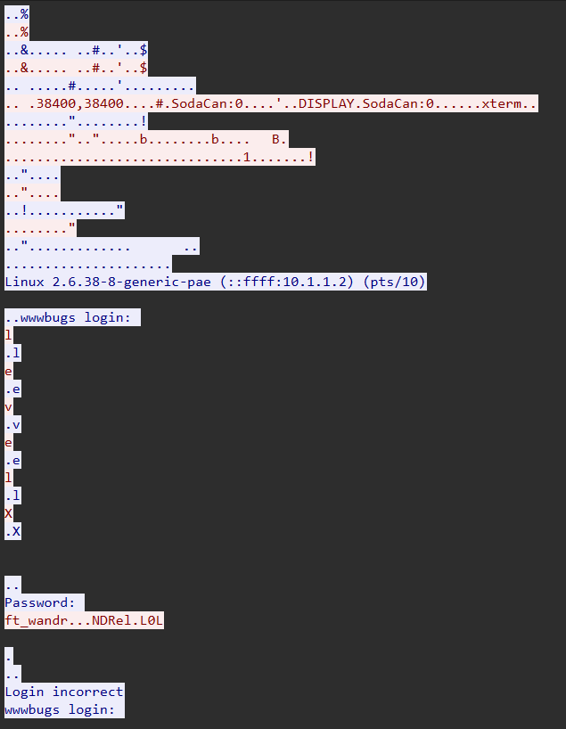
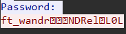

## Level 02

```bash
ls -la
total 24
dr-x------ 1 level02 level02  120 Mar  5  2016 .
d--x--x--x 1 root    users    340 Aug 30  2015 ..
-r-x------ 1 level02 level02  220 Apr  3  2012 .bash_logout
-r-x------ 1 level02 level02 3518 Aug 30  2015 .bashrc
----r--r-- 1 flag02  level02 8302 Aug 30  2015 level02.pcap
-r-x------ 1 level02 level02  675 Apr  3  2012 .profile
```

Vemos que hay un archivo .pcap que es la extension dedicada a paquetes de red
Para este caso usaremos una herramienta llamada wireshark que es gratuita y visualiza lo que hay en el .pcap



Con esto podemos ver que la contraseña es ft_wandr...NDRel.L0L
Pero si intentamos ponerla para obtener la flag nos da incorrecto… pero si nos fijamos bien con nuestra herramienta si cambiamos el modo de interpretar inputs vemos otra cosa



Asi que podemos asumir que probablemente esos carácteres sean un delete por haberse equivocado, y ahora si la contraseña seria ft_waNDReL0L

```bash
level02@SnowCrash:~$ su flag02
Password:
Don't forget to launch getflag !
flag02@SnowCrash:~$ getflag
Check flag.Here is your token : kooda2puivaav1idi4f57q8iq
```